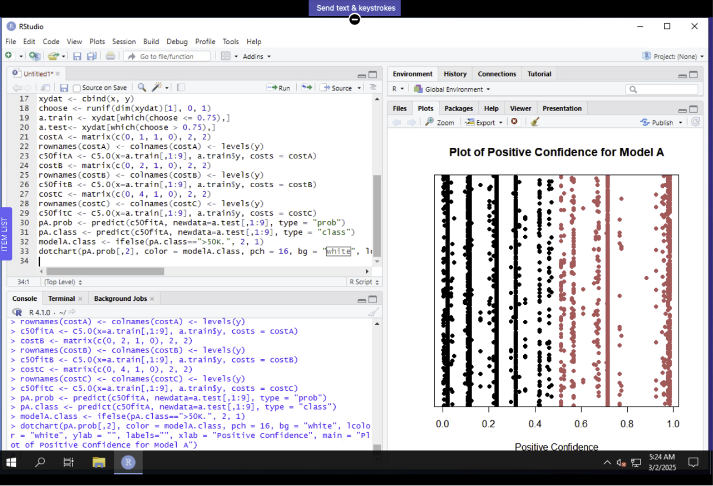
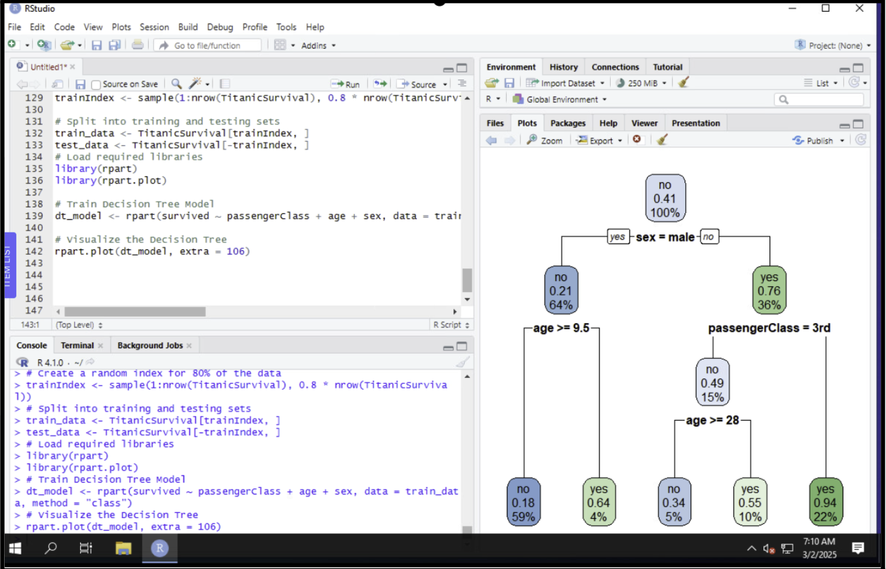
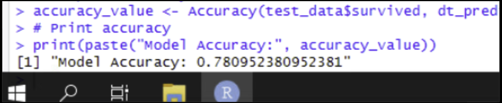
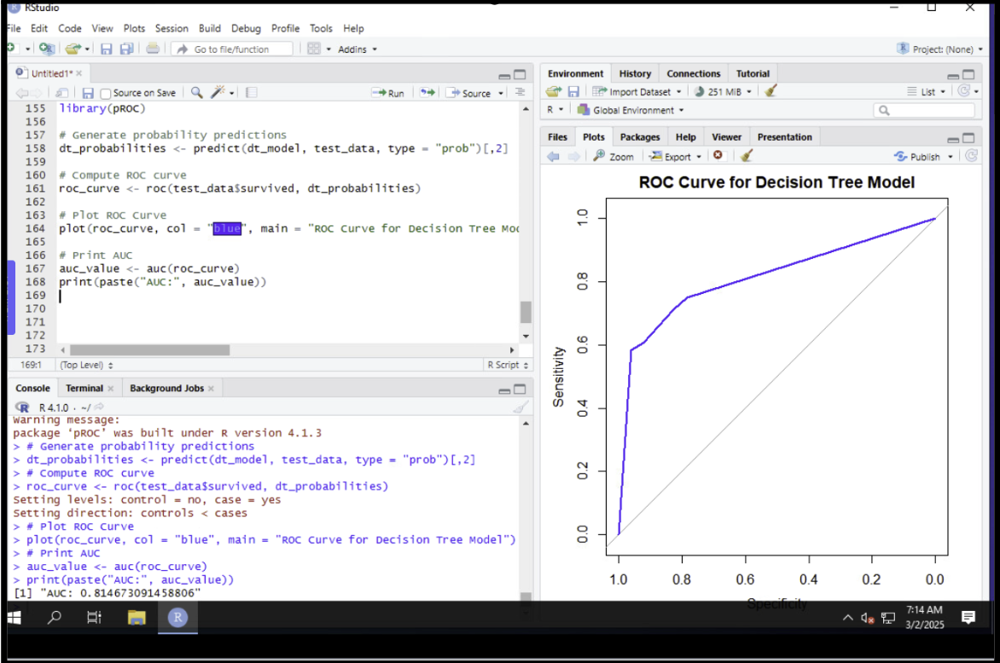

# DAT 640 Practical R Activity Eight  
## Performance Evaluation With an R Confusion Matrix  

  
  
  

---

## Overview  
This activity demonstrates how to **construct a classification algorithm** in R and evaluate its performance using a **Confusion Matrix** and **ROC Curve**. The process involved two stages:  

1. Running **uCertify Lab 11.9.1** on data-driven misclassification costs.  
2. Building a classification model on a selected dataset, evaluating accuracy, and analyzing performance metrics.  

For the second part, I selected the **TitanicSurvival dataset** (`carData` package), which contains information on Titanic passengers, including **survival status**, **age**, **sex**, and **passenger class**. The dataset was cleaned, factors were applied, and data was split into **training (80%)** and **testing (20%)**. A **Decision Tree** classification model was built with the `rpart` package and evaluated with accuracy, a confusion matrix, and a ROC curve.  

---

## Part 1: Misclassification Costs (uCertify Lab 11.9.1)  

The first lab exercise involved analyzing the effect of **misclassification costs**. By adjusting the cost of false positives and false negatives, we can shift decision thresholds and visualize confidence scores.  

  

> *Insight:* This plot shows how positive confidence shifts when misclassification costs are unequal, emphasizing the importance of balancing business impact with classification accuracy.  

---

## Part 2: Decision Tree Model on Titanic Data  

Using the Titanic dataset, I trained a **Decision Tree classifier** to predict survival.  

  

### Findings  
- **Accuracy:** **78.1%**, correctly predicting about 4 out of 5 passengers.  
- **Top Split:** **Sex** — survival rates diverged strongly by gender:  
  - Males: ~**41% survival probability**.  
  - Females: significantly higher survival probability.  
- **Age Factor:** Among males, **children (≤ 9.5 years)** had a higher survival rate (**64%**).  
- **Passenger Class:** Third-class passengers had the lowest survival probabilities (~**22%**).  

> *Interpretation:* The tree highlighted clear demographic and socioeconomic influences on survival. While interpretable, single trees risk overfitting and may struggle with borderline cases.  

---

## Part 3: Confusion Matrix Evaluation  

The **Confusion Matrix** was used to assess prediction outcomes more precisely.  

  

### Findings  
- **True Negatives:** Non-survivors were predicted most accurately.  
- **True Positives:** Survivors were captured reasonably well, but not perfectly.  
- **Errors:**  
  - **False Positives:** Some passengers predicted as survivors did not survive.  
  - **False Negatives:** Some survivors were missed, especially in borderline groups (e.g., younger males or older lower-class females).  

> *Interpretation:* The confusion matrix showed the strengths and weaknesses of the model beyond raw accuracy, emphasizing the trade-offs in sensitivity (recall of survivors) vs specificity (correctly identifying non-survivors).  

---

## Part 4: ROC Curve Analysis  

The **ROC Curve** provided a broader evaluation of model discrimination ability.  

  

### Findings  
- **AUC (Area Under the Curve):** **0.8147**, indicating strong predictive ability (well above random guessing at 0.5).  
- The curve showed a **steep initial rise**, meaning the model quickly identifies survival patterns.  
- As thresholds relaxed, performance **gradually leveled off**, highlighting challenges in borderline cases.  

> *Interpretation:* With an AUC over 0.8, the model demonstrates **good classification power**. The ROC curve complements the confusion matrix by showing how performance shifts at different thresholds, helping to identify the best trade-off between sensitivity and specificity.  

---

## Comparative Insights  

- **Decision Tree Strengths:** Easy interpretability, clear insights on survival drivers (sex, age, class).  
- **Confusion Matrix Contribution:** Provided detailed error analysis (false positives/negatives).  
- **ROC Curve Contribution:** Quantified trade-offs, confirmed predictive power (AUC = 0.8147).  

Together, these evaluation tools show that the model captures survival patterns well, but improvements could be made in borderline predictions.  

---

## Key Skills Demonstrated  
- Built and interpreted a **Decision Tree model** in R (`rpart`).  
- Applied **data cleaning, factorization, and train/test splits**.  
- Evaluated classification with **accuracy, confusion matrix, and ROC/AUC**.  
- Explained **trade-offs** in sensitivity vs specificity.  
- Translated findings into **real-world insights** about Titanic survival demographics.  

---

## Repo Description  
Decision Tree analysis on the **TitanicSurvival dataset** with performance evaluation. Includes **Confusion Matrix** and **ROC Curve** to measure classification power. Achieved **78.1% accuracy** and **AUC = 0.8147**, with survival driven by **sex, age, and passenger class**.  

---

## Tags  
